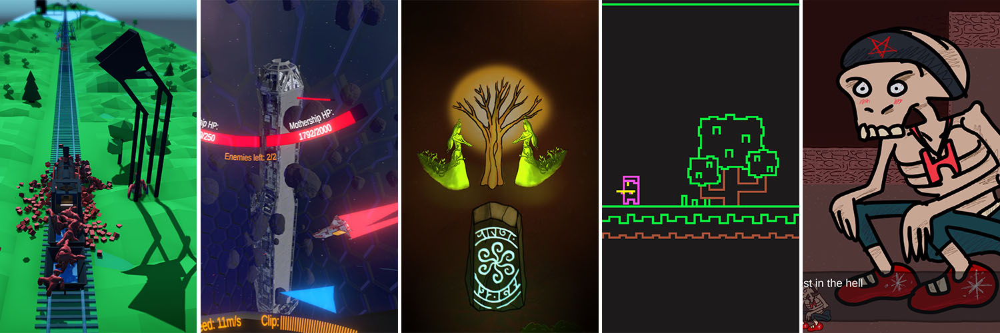

### hello world!   

  <a href="https://github.com/anuraghazra/github-readme-stats">
    
<!---    --->
  </a>

Hello! I'm Tim, a game developer who work with Unity since 2018 and have little windows and web developer experience before. I'm working on a regular developer job during day, on my own projects during night and jam on weekends from time to time. I consider myself as a gameplay programmer, but actually I can work on any part of the game, even art and music.

In general, I'm into technology, games(both digital and tabletop) and music.

In computing, I'm into game development, performance optimizations, tools/plugins writing and software architecture.

--------------

- 🔨 I'm working on [My game template](https://github.com/Team-on/UnityGameTemplate) and few unannounced games
- 👯 I'm looking for indies to make games together
- 💬 Talk to me about game dev, tools, unity, gamejams and other games related things
- 🍯 Feel free to jam with me. I usually use Unity for my games, but eager to try other engines or roles for gamejams

--------------

--------------

My own assets: **Screen Shooter**([Asset store](https://assetstore.unity.com/packages/slug/188939) | [OpenUPM](https://openupm.com/packages/com.teamon.screenshooter.html) | [GitHub](https://github.com/Team-on/UnityScreenShooter)), **Build Manager**([Asset store](https://assetstore.unity.com/packages/slug/188940) | [OpenUPM](https://openupm.com/packages/com.teamon.buildmanager.html) | [GitHub](https://github.com/Team-on/UnityBuildManager))

Assets that I supported: [CustomToolbar](https://github.com/Team-on/CustomToolbar), [Unity3D-save-audioClip-to-MP3](https://github.com/Team-on/Unity3D-save-audioClip-to-MP3), [ProjectWindowDetails](https://github.com/Team-on/ProjectWindowDetails), [Unity3D Rainbow Folders](https://github.com/Team-on/unity3d-rainbow-folders), [Editor Spotlight](https://github.com/Team-on/unity-editor-spotlight), [Selection History Window](https://github.com/Team-on/unity-history-window), [Node Based Dialogue System](https://github.com/Team-on/NodeBasedDialogueSystem), [Git Package Updater](https://github.com/Team-on/UnityGitPackageUpdater), [SteamVR Plugin](https://github.com/Team-on/steamvr_unity_plugin)

Unity games: [Murdertrain](https://github.com/savik-games/Murdertrain-A-Comin)

C#/WPF Games: [TownsNWarriors](https://github.com/Team-on/TownsNWarriors), [ProveAA](https://github.com/Team-on/ProveAA), [Multiplayer shooter](https://github.com/Team-on/Multiplayer-shooter), [Impalers](https://github.com/Team-on/Impalers), [S.P.A.C.E., inc.](https://github.com/Team-on/LD42)

Other: [Website](https://github.com/Team-on/team-on.github.io), [Works](https://github.com/Team-on/works)
